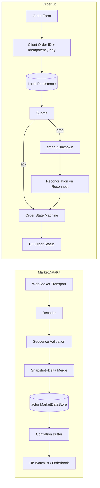

# Exchange24Kit

Stock-exchange trading primitives — real-time market data + order integrity. Not an e-commerce/marketplace kit.

A Swift Package that models the two hardest client-side problems in a
trading app: **keeping a live price feed correct and smooth under load**,
and **never letting a network failure turn one order into two (or zero)**.

Built as two independent, testable modules — not a demo app with logic
buried in view controllers.

Status: skeleton — see [Roadmap](#roadmap).

## Table of Contents
- [Why this exists](#why-this-exists)
- [Glossary](#glossary)
- [Architecture](#architecture)
- [Modules](#modules)
- [End-to-end flow](#end-to-end-flow)
- [Roadmap](#roadmap)
- [Running tests](#running-tests)

## Why this exists

Most iOS portfolio projects prove you can call an API and bind it to a
list. This one proves two narrower, harder things a trading app actually
lives or dies on:

1. A live feed for thousands of ticking instruments has to stay correct
   (no stale/duplicate/out-of-order prices) *and* smooth (no dropped
   frames), even on a bad connection.
2. An order placed right as the network drops must never be silently
   assumed successful, silently assumed failed, or silently resubmitted
   as a brand-new order.

Everything here is a **technical preparation model** — it is not a claim
about how any specific brokerage's app is built.

## Glossary

| Term | Meaning here |
|---|---|
| **Snapshot** | Full current state of subscribed instruments, requested on connect/resync |
| **Delta** | An incremental price/volume update for one instrument |
| **Sequence number** | Per-instrument counter used to detect gaps, duplicates, and out-of-order delivery |
| **Conflation** | Collapsing many rapid updates for the same instrument into the latest value, flushed to UI on a fixed interval instead of per-message |
| **Client Order ID** | UUID generated on-device *before* any network call; doubles as the idempotency key |
| **Idempotency** | Retrying a submit with the same Client Order ID never creates a second order |
| **`timeoutUnknown`** | A first-class order state for "network dropped mid-submit" — not success, not failure, not silently retried |
| **Reconciliation** | On reconnect/foreground, querying the server by Client Order ID to resolve any non-terminal local order state |

## Architecture



## Modules

- **`MarketDataKit`** — connection lifecycle, reconnect/backoff, snapshot+delta
  merge, conflation. No UI, no networking framework lock-in (transport is
  injected).
- **`OrderKit`** — order state machine, Client Order ID generation,
  persistence contract, reconciliation. No UI, no networking framework
  lock-in.

Both are independently unit-testable with zero real network calls —
event sequences (gapped, duplicated, out-of-order, dropped) are injected
directly.

## End-to-end flow

1. App launches → `OrderKit` checks local storage for any non-terminal
   order → reconciles by Client Order ID before showing anything.
2. Screen appears → `MarketDataKit` connects, requests a snapshot, then
   streams deltas.
3. User watches prices tick → conflation buffer coalesces rapid updates,
   flushes to UI on a fixed interval → UI stays smooth regardless of
   message volume.
4. User submits an order → Client Order ID generated and persisted
   *before* the network call → submit.
5. If the network drops before an ack arrives → order enters
   `timeoutUnknown`, never silently retried with a new ID.
6. On reconnect → reconciliation resolves `timeoutUnknown` to whatever
   the server actually did.

## Roadmap

- [x] SPM skeleton (this commit)
- [x] CI stub (build + test on push/PR)
- [ ] Fake event generator (snapshot/delta/drop/duplicate/reorder)
- [ ] Connection manager (`AsyncStream`, exponential backoff + jitter)
- [ ] Snapshot+delta merge engine + tests
- [ ] Conflation/throttle layer
- [ ] Order state machine + idempotency + persistence
- [ ] Reconciliation logic + failure-scenario tests
- [ ] Demo SwiftUI app wiring both modules

## Running tests

```bash
swift test
```
